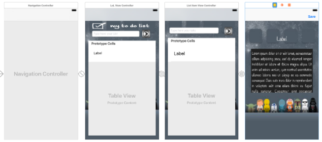
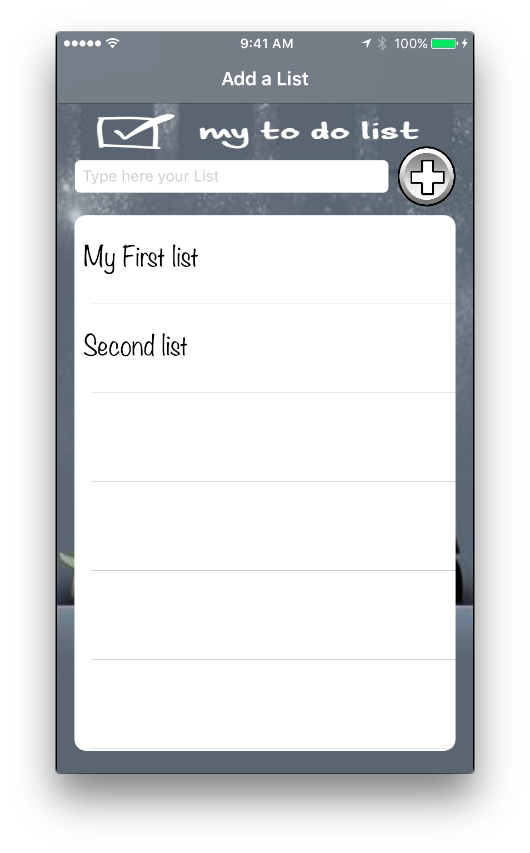
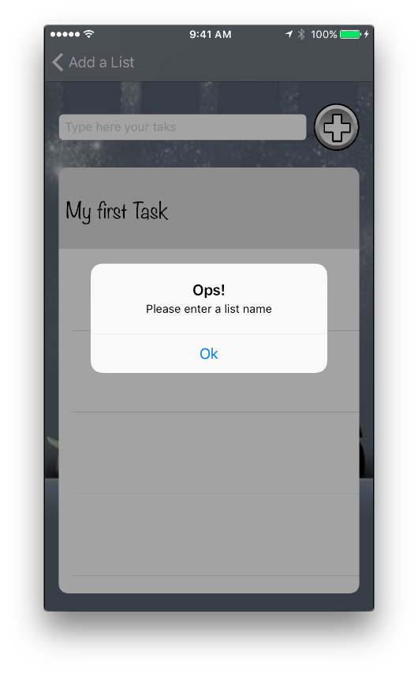
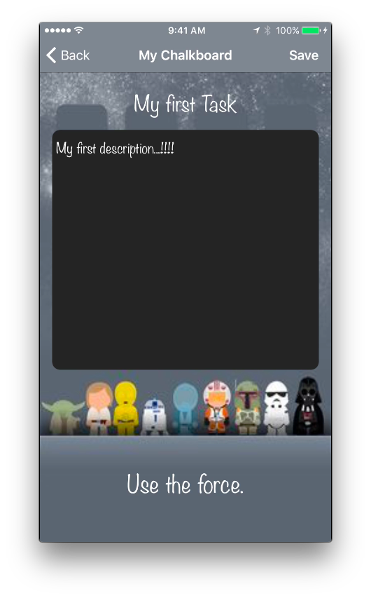

# To Do Chalkboard App

##### by

*Israel Manzo*

*Developer info click [here](https://www.linkedin.com/in/israel-manzo/)*

## First iOS project
This is an App that allows the user to create a list of task, and each list contains a detail chalkboard description. Also, the application will remind the user about the list saved.

## List of List
* This App allows the user to create a new list of task.
* The list will be selected from the table and drives to a next view.

## List of Task
* The user can create a new task on the table and inside the first list created.
* The user is able to tap on the Task and go to a description view.

## Description Chalkboard View
* At this view, the user is able to create a detail or description of duties for that task created in the first list

* Once the user is finished with the details of descriptions of that task, is able to save the information

* The user is able to go back to List of List and create a new list

## Wireframe View 

## Main List View

## Alert Message

## Detail View

